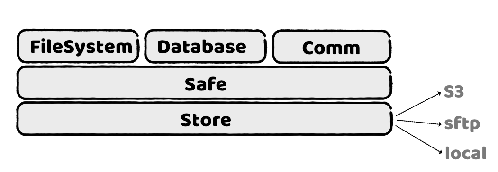

# Introduction
When you rent an apartment, you do not own it. While you have the right to use it, 
the landlord has the keys to the front door. The same is true for cloud storage. 
When you store data in the cloud, you are renting space. 
The cloud provider has the keys to your data.

Stash is a library designed to enhance data security by applying strong encryption to all data stored in remote locations, including the cloud. In addition to encryption, Stash enables multiple peers to access the encrypted information. Peers can be added or removed from data access based on the data administrator's discretion.

Additionally, Stash offers various popular paradigms for accessing and managing data, including files, relational tables, and messages. The architecture is built on multiple layers, as illustrated in the following diagram.

<center>

</center>

The following documentation uses pseudo-Python for simplicity and readability. The library itself is implemented in Go and provides bindings for Java, Python, and Dart.

## Store
The basic layer provides a convenient abstraction for popular storage services, such as S3, SFTP, and the local file system. Support for Azure Storage will be available soon.
This abstraction provides a simple interface for writing and reading files in remote locations. For clarity, the interface is described in pseudo-Python, although the actual implementation is in Go.

```python
    class Store:
        readDir(name, filter)
        read(name, rang, dest, progress)
        write(name, source, progress)
        stat(name)
        delete(name)

    s = Open('s3://....')
    write('hello.txt', b'world', None)
    d = read('hello.txt', b'world', None)
```

## Access control
The second layer, the _Safe_, implements the encryption logic. A Safe resembles the access model based on groups and users popularized by the Unix operating system. A group is a set of users who share specific access rights within the system. For example, Linux has a group named _adm_ for users with administrative privileges.

In a centralized system, such as Unix, users trust the restricted access to the groups information. Typically, only administrators can modify the group membership, and the system maintains the current state of the group. Unix often has a file _groups_ that lists the users belonging to each group.

In a remote storage environment, where access is available to different actors, including the cloud provider, access information requires a different level of protection. In such distributed systems, a single trusted location does not exist, and peers may not fully trust each other. This makes it challenging to ensure the integrity and security of access information.

The solution is to use a blockchain where access to a group is granted or revoked following a chain of valid changes, starting from the creator of the Safe. This approach ensures that the current state of the groups can be reconstructed at any time by replaying the changes from the history, providing a secure and verifiable method of managing access rights in a distributed environment.

### The chain
A change in a group is defined by cryptographically signed block.

```python

class GroupChange:
    groupName       # the group that will be changed
    userId          # identifier of the user in the group
    change          # type of change
    signer          # the user that makes the change
    signature       # the ed25519 signature

```

For instance, the user _Alice_ can grant access to the user _Bob_ to a group _users_ with the following block

```python
GroupChange(121, 120, 'users', 'Bob', True, Alice, 0x39393...)
```

A block ID is a type of Snowflake ID, which ensures it is not only unique but also incrementally increasing.

### Why blocks are signed
Only members of the _adm_ group are granted the permissions to add or remove users from a group.

In this context, verifying the identity of the user who initiates a change is of utmost importance. This verification is typically achieved through a signature. The block incorporates both the user ID and the block's signature. The user ID includes a ed25519 public key, which is utilized to validate the signature.

### Why blocks are chained
Each block is linked to its predecessor by referencing the predecessor's ID. Additionally, the signature of the block utilizes the hash of the previous block. This chaining mechanism ensures that any unauthorized changes to a block will invalidate the hashes of all subsequent blocks, making tampering easily detectable and preventing unauthorized modifications.

Periodically the chain on the remote storage is aligned with the group information available locally. If the remote chain
contains new blocks, those are copied locally. Simmetrically when the local information contains more groups, those are
copied to the remote storage. Finally if a conflict exists, the alignment is aborted.

### First block
Initially, all groups, including the _adm_ group, are empty at the start of the chain. An exception is made for the first block, where the rules are relaxed for a special user known as _creator_. Typically, the _creator_ user adds themselves to the _adm_ group in the first block.

## File system interface
File systems provide a convenient and familiar way to store information. Stash offers an intuitive interface for writing and reading files within a hierarchical structure.


```python

class FileSystem:
    putData(dest, src, options)
    putFile(dest, src, options)
    getData(src, options)
    getFile(src, dest, options)
    list(dir, options)
    rename(old, new)
    delete(name)

safe = open(db, me, 's3://...')
fs = safe.fs()
fs.putFile('hello.txt', './hello.txt', {tags: ['test', 'txt']})
fs.getFile('hello.txt', './hello.copy.txt', {})
fs.delete('hello.txt')
```

Unlike most file systems, the Stash file system automatically versions data. New files are stored without overwriting older versions. Consequently, the _delete_ operation removes only the most recent version of the file with the specified name. The _File_ object, returned by the _stat_ and _list_ operations, provides an ID and other information to distinguish between different versions.

```python

class File:
    id
    dir
    name
    isDir
    creator
    size
    modTime
    tags
    attributes
    localCopy
    copyTime
    encryptionKey
```

## DB interface
DB is an interface that synchronizes local databases and uses Stash to propagate changes across different peers that belong to group, ensuring that all connected databases remain consistent and up-to-date. Currently, support is limited to the SQLite database embedded in Stash. However, support for other databases may be extended in the future.

Similar to the file system, access to data is restricted to users within the same group. Therefore, the DB interface requires a group name, and the current user must be a member of that group.

Synchronization across remote peers is a complex process that requires a deeper understanding. It involves ensuring that all peers have consistent local copies, in spite of challenges such as network latency, data conflicts, and the varying availability of peers. 
Let us analyse the different aspects of the process.

### Replication mechanism 
There are several methods to replicate data across SQL databases. The most straightforward approach, currently employed by Stash, is statement-based replication. In this method, SQL queries are serialized and then applied to each local database.

However, this approach has some notable limitations:
- Certain SQL functions, such as `NOW()` or `RAND()`, can yield different results on different local databases, leading to inconsistencies.
- Statements with side effects may produce varying side effects on each replica, potentially causing unintended behavior.

To mitigate these issues, it is advisable to keep SQL commands simple and avoid using triggers or stored procedures.

### Concurrent writes
A key principle in Stash is communication across different peers using a common encrypted storage. This design assumes all peers are equal and can write to or read from the storage concurrently. In other words, it follows a multi-leader replication model with a star topology: all users write to the encrypted store.

A key challenge with the approach is the risk of conflict when different users change the same data. A definitive solution to this problem does not exist but there are strategies to mitigate or manage it.

#### Conflict-Free Replicated Data Types
A conflict-free replicated data type (CFRDTs) is a data type that is robust against replication. Stash offers a CFRDT counter API to increase or decrease a counter stored on DB. 

#### Timestamp and transaction
Other updates may lead to conflicts. In such cases, Stash resolves conflicts based on the timestamp when the changes were committed locally. Stash periodically synchronizes the clock with an NTP server, ensuring that different peers have nearly the same time. This mechanism is effective when concurrent updates are infrequent.

Moreover the API assumes that all dependent changes are grouped together in a single transaction.

### API and Sample

```python

class Transaction:
    exec(key, args)
    add_counter(key, val)
    commit()
    rollback()

class DB:
    query(key, args)
    get_counter(key)
    transaction()

safe = open(db, me, 's3://...')
group = 'usr'
ql = safe.db(group, {})

tx = ql.transaction()
tx.exec("INSERT INTO sample(title, content) VALUES (:title, :content), {title: "hello", content: "world" } )
tx.add_counter('test', +1)
tx.commit

rows = ql.query("SELECT content FROM sample where TITLE=:title", {title: "hello"})
cnt = ql.get_counter('test')

```

### Stored statements 
The interface supports named and reusable SQL statements. When creating a DB instance, you only need to provide the SQL code. Each SQL statement must be prefixed with a comment, which serves as the key for the statement.
The only exception is the `INIT` comment, which initializes the database structure. Since `INIT` statements are executed every time the instance is created, they must include conditions to create the structure only when necessary.
Each statement should be separated by an empty line from the next.

```python
safe = open(db, me, 's3://...')
group = 'usr'

ddl = '''
-- INIT 
CREATE TABLE IF NOT EXIST sample (
    title VARCHAR(1024) NOT NULL, 
    sample VARCHAR(128) NOT NULL,
)

-- INIT 
CREATE INDEX IF NOT EXISTS idx_sample_title ON content(title)

-- INSERT_CONTENT
INSERT INTO sample(title, content) VALUES (:title, :content)

-- SELECT_CONTENT
SELECT content FROM sample where TITLE=:title

'''
ql = safe.db(group, {1.0: ddl})

tx = ql.transaction()
tx.exec("INSERT_CONTENT", {title: "hello", content: "world" } )
tx.commit

rows = ql.query("SELECT_CONTENT", {title: "hello"})

```


## Messanger interface
The Messanger interface allows sending messages to a specific peer or to the peers that belong to a group.
The message can contain an attached file

```python

safe = open(db, me, 's3://...')
group = 'usr'
alice = '

m = safe.messanger()
m.send(alice, "happy birthday", file="birthday.jpg")
m.broadcast(usr, "it is Alice's birthday", file="birthday.jpg")


safe = open(db, alice, 's3://...')
m = safe.messanger()
msgs = m.receive('')
m.download(msgs[0], 'picture.jpg')

```

Messages broadcasted to a group use the encryption key associated with the group.
Messages sent to a single peer use the peer's public key to encrypt the message.